# PLL(Permutation of the Last Layer)
------

* ####EPLL `Permutations of Edges Only`  

	
	
	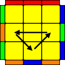
	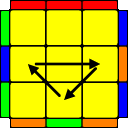
	
* ####CPLL `Permutations of Corners Only`
 
	
	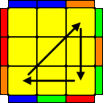
	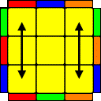

* ####`Permutations of Edges and Corners`
 
	
	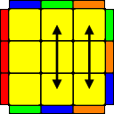
	
	

	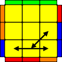
	
	
	

	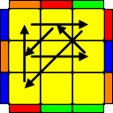
	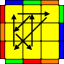
	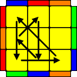
	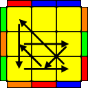

	&nbsp;&nbsp;&nbsp;&nbsp;&nbsp;&nbsp;&nbsp;&nbsp;&nbsp;&nbsp;
	&nbsp;&nbsp;&nbsp;&nbsp;&nbsp;&nbsp;&nbsp;&nbsp;&nbsp;&nbsp;
	&nbsp;&nbsp;&nbsp;&nbsp;&nbsp;&nbsp;&nbsp;&nbsp;&nbsp;&nbsp;
	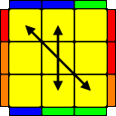
	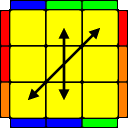
